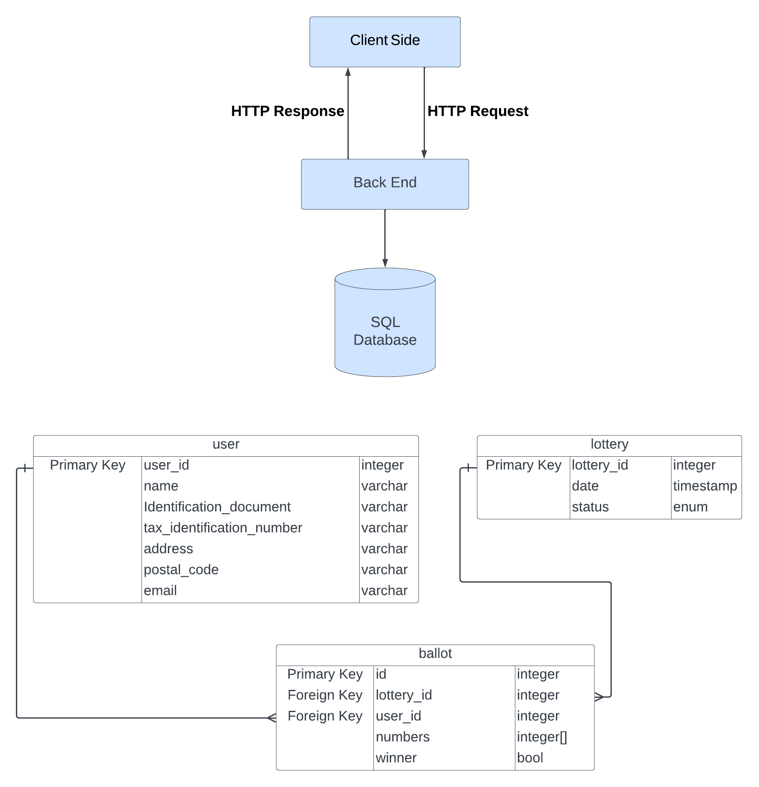

# lottery

## Heroku

The application is currently deployed in Heroku and can be accessed via the following link:

https://stormy-sierra-38271.herokuapp.com/

## Installation Instructions

This is a Spring Boot application that requires Java 17, Maven, and a PostgreSQL database to run.

### Prerequisites

Before you can compile and run this application, you will need to have the following software installed on your machine:

- Java 17
- Maven
- PostgreSQL

### Installing Java 17

If you do not have Java 17 installed on your machine, you can download it from the official website: [https://www.oracle.com/java/technologies/javase-jdk17-downloads.html](https://www.oracle.com/java/technologies/javase/jdk17-archive-downloads.html)

### Installing Maven

If you do not have Maven installed on your machine, you can download it from the official website: [https://maven.apache.org/download.cgi](https://maven.apache.org/download.cgi)

### Installing PostgreSQL

If you do not have PostgreSQL installed on your machine, you can download it from the official website: [https://www.postgresql.org/download/](https://www.postgresql.org/download/)

Once you have PostgreSQL installed, you will need to create a database for this application. You can do this by running the following command:

`createdb my_database_name`

Replace `my_database_name` with the name you want to give your database.

### Configuring the Database Connection

Next, you will need to configure the database connection settings in the 'application.properties' file. This file can be found in the 'src/main/resources' directory. Here is an example of how you could configure the connection settings:

`spring.datasource.url=jdbc:postgresql://localhost:5432/my_database_name`

`spring.datasource.username=my_username`

`spring.datasource.password=my_password`

Replace `my_database_name`, `my_username`, and `my_password` with the actual values for your database.

### Compiling the application

To compile and build the application, navigate to the root directory of the project in your terminal or command prompt and run the following command:

`mvn clean install`

This will generate an executable JAR file in the 'target' directory. 

### Running the application

To run the application, navigate to the 'target' directory and run the following command:

`java -jar lottery-0.0.1-SNAPSHOT.jar`

## Technologies used

- <ins> Java 17</ins>
- <ins> Maven</ins>
- <ins> Spring Boot:</ins> I chose to use Spring Boot, instead of the standard Spring framework I am more familiar with, due to the simplicity of the application. Spring Boot's embedded web server, simplified configuration and annotations allowed me to develop the application faster.
- <ins> PostgreSQL:</ins> Given the relationships between the main entities of the application (ballot, lottery_event, and user) and the fact that we are not dealing with large volumes of data I decided to use a relational database.
- <ins> Thymeleaf:</ins> I wanted to explored server-side rendering of HTML and since Thymeleaf has easy integration with Spring I used it to render the frontend of the application. 

## Requirements

### The service allows anyone to register as a lottery participant

Users can register as lottery participants through the Register page in the UI which populates the fields of a userDto. Upon submission, the user input is validated to ensure it meets the required criteria. Valid users are saved to the SQL database.

### Lottery participants will be able to submit as many ballots as they want for any lottery that isn't yet closed

It was assumed that everyday at midnight the lottery event of the previous day is closed and a new one is created. So every ballot submitted will be associated with the lottery event of the current day. 

Users can submit ballots through the Submit Ballot page in the UI by providing their email address. On the backend, the ballot will be linked with the current day's lottery event and the user for record-keeping. Ultimately, the ballot will be saved in the database.

### Each day at midnight the lottery event will be closed and a random lottery winner will be selected

A scheduled task runs every day at midnight and selects a winner by following the algorithm below:

1. Count the nº of ballots in the current lottery event (num_ballots)
2. Generate a random number between 0 and num_ballots - 1 (n)
3. Select the nth ballot in current lottery event as winner

### All users will be able to check the winning ballot for any specific date.

By visiting the Check Winning Ballots UI page, users can check the winning ballot for a specified date. Upon submission, the backend will run a query that selects from the ballots in lottery event of the chosen date the one marked as winner.

## Extra feature

Users have the ability to simulate spinning the lottery tombola and generating a winner by using the Simulate Today's Winner UI page.

## Ideas for Future Work

1. Implement login authentication so that a user can only submit ballots for himself.
2. Present the data retrieved from the backend in a visually appealing manner.

### System Architecture
---

